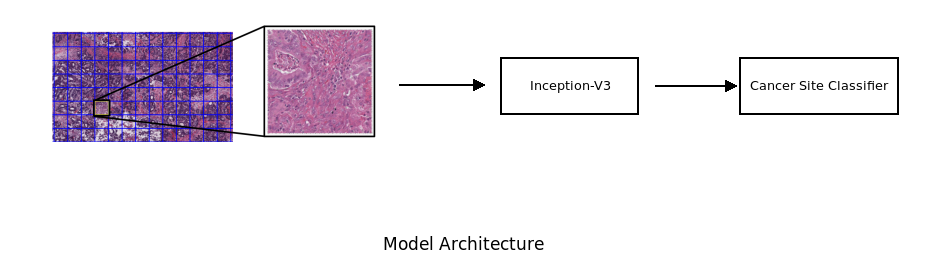

# Cancer Site Classification

This is a small example for you to get started with your course. 

<p align='center'>  
  
</p>


## Prerequisites
- tensorboard==1.11.0
- tensorboardX==1.4
- torch==0.4.1
- torchvision==0.2.1
- tqdm==4.19.5
- openslide-python==1.1.1

## Getting Started

### Installation and Download
- install all required libs
- clone this rep
```bash
git clone https://github.com/zhangrenyuuchicago/CancerSiteClassification
cd CancerSiteClassification
```
- download the dataset

I prepared a small dataset. you can download <a href="https://arxiv.org/abs/1803.04054"> this toy dataset </a> and put it in rep folder. You can also try some other dataset.

### Extract tiles
Run the scripts to extract all the tiles contains tissues from the slides. Here we simply calculate the intensity of all the grayscale pixel value. If the intensity of a tile is blew the threshold, we extract the tile. 

```bash
cd gen_feature
python gen_tile.py
```

### Train model

```bash
cd model
sh run.sh
```

